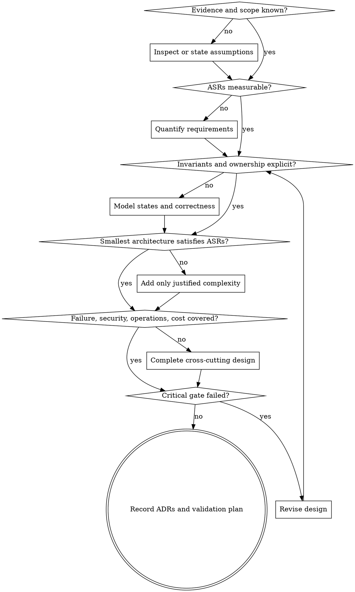

# System Architecture Harness

## Overview

Turn an idea, requirement set, existing codebase, incident pattern, or migration goal into an evidence-backed architecture that can be implemented, operated, reviewed, and evolved.

**Core principle:** Architecture is a chain of explicit decisions under constraints—not a diagram, a technology list, or a collection of fashionable patterns.

## Non-Negotiable Architecture Law

```text
NO ARCHITECTURE DECISION WITHOUT:
1. a requirement, invariant, risk, or constraint that motivates it;
2. at least one realistic alternative;
3. a stated trade-off and consequence;
4. a way to validate the decision in production or before launch.
```

A component without a responsibility is decoration. A database without access patterns and consistency semantics is guesswork. A queue without delivery, ordering, retry, and replay semantics is an outage waiting for a date.

## When to Use

Use this skill for:

- greenfield system design;
- architecture review or due diligence;
- monolith/modular-monolith/microservice boundary decisions;
- scaling, performance, reliability, or cost redesign;
- data-platform, event-driven, real-time, financial, geospatial, storage, or AI systems;
- cloud, on-premises, hybrid, multi-region, edge, or offline-first deployments;
- migrations, decompositions, re-platforming, and legacy modernization;
- production readiness, threat modeling, disaster recovery, and operational design;
- architecture specifications, RFCs, ADRs, review scorecards, and implementation handoff.

Do not use it as a substitute for product discovery, legal advice, formal safety certification, penetration testing, or domain-expert approval. It should expose when those are required.

## Select the Operating Mode

| Mode | Trigger | Primary output |
|---|---|---|
| **Explore** | Requirements are incomplete or several concepts are plausible | assumptions, questions, options, recommendation |
| **Design** | Building a new system or major capability | complete architecture specification |
| **Review** | An architecture or codebase already exists | evidence-based findings, score, risks, prioritized remediation |
| **Scale** | Current system works but misses load, latency, availability, or cost goals | bottleneck model, target design, staged changes |
| **Migrate** | Moving data, traffic, runtime, ownership, or architecture style | current/target states, transition states, cutover and rollback |
| **Incident-driven** | Repeated incidents reveal structural faults | failure analysis, violated assumptions, resilience changes |

If the user does not select a mode, infer it and state the inference in one sentence.

## Required Context Loading

Read only the references needed for the task. The workflow and gates are always required.

| Situation | Required references |
|---|---|
| Any architecture task | `references/01-workflow-and-decision-gates.md` |
| Requirements, capacity, latency, availability | `references/02-requirements-estimation-and-slos.md` |
| Service boundaries or architecture style | `references/03-boundaries-and-architecture-styles.md` |
| Database, cache, search, consistency, tenancy | `references/04-data-storage-and-consistency.md` |
| REST/gRPC/events/queues/workflows | `references/05-apis-messaging-and-workflows.md` |
| Scale, performance, overload, cost | `references/06-scalability-performance-and-cost.md` |
| Fault tolerance, region failure, recovery | `references/07-reliability-resilience-and-disaster-recovery.md` |
| Auth, threats, privacy, compliance | `references/08-security-privacy-and-compliance.md` |
| Telemetry, release, operations, ownership | `references/09-observability-operations-and-delivery.md` |
| Familiar system patterns or specialized domains | `references/10-domain-pattern-catalog.md` |
| LLM, RAG, ML, agent, model-serving system | `references/11-ai-ml-and-agentic-systems.md` |
| Formal review or final quality gate | `references/12-architecture-review-scorecard.md` |
| Source-repository coverage and additions | `references/13-repo-coverage-and-gap-analysis.md` |
| Standards and source provenance | `references/14-source-map.md` |

## Architecture Workflow

Do these phases in order. You may iterate backward when a later decision invalidates an earlier assumption, but never silently skip a phase.

### Phase 0 — Establish Evidence and Scope

1. Identify whether this is greenfield, review, migration, scaling, or incident-driven work.
2. For an existing system, inspect the repository, deployment manifests, schemas, API contracts, telemetry, incidents, and current diagrams before proposing changes.
3. Separate confirmed facts, user-provided constraints, measurements, estimates, and assumptions.
4. Define the decision horizon: prototype, first production release, 12-month target, or long-term platform.
5. State what is out of scope and what requires a specialist.

**Gate 0:** Do not design against an imagined system when evidence is available.

### Phase 1 — Define Outcomes and Architecturally Significant Requirements

Capture:

- users, actors, tenants, administrators, operators, external systems, and adversaries;
- critical user journeys and business outcomes;
- functional requirements and explicit non-goals;
- quality attributes with measurable targets: latency, throughput, availability, durability, correctness, freshness, privacy, recovery, cost, and operability;
- regulatory, residency, contractual, platform, team, deadline, and budget constraints;
- workload shape: read/write ratio, payload distribution, burstiness, seasonality, geography, hot keys, fan-out, and concurrency;
- failure impact by journey and data class.

Convert vague words into measures. “Fast,” “real-time,” “highly available,” “secure,” and “scalable” are not requirements until their meaning is bounded.

**Gate 1:** Every major architecture choice must trace to at least one architecturally significant requirement (ASR), invariant, risk, or constraint.

### Phase 2 — Quantify the Workload

Estimate, with visible units and assumptions:

- average and peak requests/events per second;
- concurrent connections and active sessions;
- storage growth, retention, replication, index, and backup overhead;
- ingress/egress and internal bandwidth;
- CPU-, memory-, disk-, network-, and accelerator-sensitive work;
- cache working set and hit-rate target;
- partition counts, consumer concurrency, and backlog drain time;
- dependency quotas and external-service rate limits;
- expected unit cost and cost at 1×, 10×, and 100× load.

Use ranges when uncertainty is material. Perform sensitivity analysis on the assumptions that change the design.

**Gate 2:** No claim of “scales to X” without a capacity model and bottleneck hypothesis.

### Phase 3 — Model Invariants, States, and Correctness

Before choosing storage or services, write:

- business invariants that must never be violated;
- aggregate or transaction boundaries;
- state machines and legal transitions;
- source of truth for each critical entity;
- concurrency model and conflict policy;
- consistency and freshness required per read path;
- idempotency scope and deduplication lifetime;
- ordering requirements and the scope in which order matters;
- reconciliation and repair strategy;
- audit and lineage requirements.

For money, inventory, quota, entitlement, identity, or trading systems, correctness dominates convenience. Use exact numeric representations and explicit ledgers/reconciliation where applicable.

**Gate 3:** If an invariant has no enforcement point, the design is incomplete.

### Phase 4 — Draw Boundaries and Assign Ownership

Start with the smallest architecture that satisfies the ASRs.

1. Draw a system context: actors, system boundary, external dependencies, trust boundaries.
2. Define capabilities/domains and the data each owns.
3. Choose architecture style based on evidence: modular monolith, service-oriented/microservices, event-driven, serverless, edge, pipeline, actor, or hybrid.
4. Assign one accountable owner for every runtime component, data store, event contract, and operational journey.
5. Define permitted dependencies and forbidden coupling.
6. Identify control plane vs data plane and synchronous critical path vs asynchronous side effects.

Default to a well-structured modular monolith when independent deployment, scaling, ownership, isolation, compliance, or technology needs do not justify distribution.

**Gate 4:** A service boundary that does not improve ownership, deployability, scale isolation, fault isolation, security, or domain integrity is likely accidental complexity.

### Phase 5 — Design Data, Interfaces, and Workflows

For every data store, specify:

- ownership and source of truth;
- access patterns and query shapes;
- schema, keys, indexes, partition key, and growth;
- consistency, transaction, isolation, and durability needs;
- replication, backup, retention, archival, deletion, and restore;
- cache policy, invalidation, stampede protection, and stale behavior;
- schema evolution and migration compatibility.

For every API/event, specify:

- consumers and purpose;
- contract, validation, authentication, authorization, and error model;
- versioning and backward/forward compatibility;
- deadlines, timeouts, retryability, rate limits, pagination, and quotas;
- idempotency and duplicate handling;
- event key, ordering scope, delivery semantics, retention, replay, and dead-letter handling.

For each critical user journey, provide a success sequence and at least one failure/recovery sequence.

**Gate 5:** Never use an uncoordinated cross-system dual write. Use a local transaction plus outbox/CDC, an idempotent workflow, or an explicit distributed-transaction protocol whose costs are justified.

### Phase 6 — Design for Performance, Scale, and Overload

Evaluate the complete path, not just the database:

- latency budget per hop and tail-latency behavior;
- horizontal and vertical scaling limits;
- partitioning/sharding and resharding;
- hot keys, skew, celebrity users, and uneven tenants;
- batching, compression, pagination, indexing, precomputation, and materialized views;
- caching and CDN placement;
- queue capacity, lag, backpressure, and backlog drain rate;
- connection pools, thread pools, file descriptors, memory pressure, and GC;
- dependency quotas and noisy-neighbor isolation;
- overload controls: admission control, bounded queues, concurrency limits, load shedding, graceful degradation, and retry budgets.

**Gate 6:** Autoscaling is not overload control. The design must remain bounded while capacity is unavailable or scaling is delayed.

### Phase 7 — Engineer Failure and Recovery

Build a failure matrix covering process, host, zone, region, network partition, dependency, datastore, queue, cache, certificate, credential, deploy, configuration, operator, and data-corruption failures.

For each failure, state:

- detection signal and owner;
- containment boundary and blast radius;
- user-visible behavior and degraded mode;
- retry/failover/recovery mechanism;
- data-loss and duplication possibility;
- recovery time objective (RTO) and recovery point objective (RPO);
- restoration, reconciliation, and proof of recovery.

Apply deadlines, bounded retries with exponential backoff and jitter, circuit breakers where they prevent repeated harm, bulkheads, idempotency, fencing, health checks, and tested failover.

**Gate 7:** Replication is not backup. Multi-zone is not disaster recovery. A recovery claim is not valid until restore/failover has been exercised.

### Phase 8 — Threat-Model Security, Privacy, and Abuse

1. Classify data and map its full lifecycle.
2. Mark trust boundaries and privileged actions.
3. Enumerate threats, abuse cases, fraud cases, tenant-escape paths, and supply-chain risks.
4. Define identity, authentication, authorization, service identity, least privilege, and separation of duties.
5. Define secrets/KMS/key rotation, encryption in transit/at rest, tokenization, redaction, and audit.
6. Define retention, deletion, consent, residency, export, and breach/incident procedures.
7. Protect APIs against object-level authorization failures, injection, resource exhaustion, replay, mass assignment, and unsafe third-party consumption.
8. For high-risk domains, require specialist review and evidence of applicable controls.

**Gate 8:** “Internal service” is not an authorization model. Network location alone never grants trust.

### Phase 9 — Make It Operable and Changeable

Specify:

- service-level indicators (SLIs), service-level objectives (SLOs), and error-budget policy;
- logs, metrics, traces, audit events, correlation IDs, and cardinality limits;
- dashboards and alerts tied to user impact, saturation, lag, correctness, and security;
- runbooks, escalation, on-call ownership, dependency contacts, and status communication;
- health/readiness semantics and synthetic probes;
- infrastructure as code, reproducible environments, configuration validation, and secrets delivery;
- test pyramid plus contract, integration, load, soak, chaos, security, migration, restore, and DR tests;
- backward-compatible deployments, progressive delivery, rollback/roll-forward, and feature flags;
- database/event migration sequence and compatibility window;
- deprecation, lifecycle, and end-of-life policy.

**Gate 9:** A system with no owner, SLO, telemetry, runbook, rollback path, or recovery test is not production-ready.

### Phase 10 — Check Economics, Sustainability, and Organization

Provide:

- cost drivers and unit economics;
- expected monthly range at baseline and growth scenarios;
- storage/egress/observability/managed-service/license costs;
- cost anomaly signals, budgets, and ownership;
- build-vs-buy analysis including lock-in, exit, compliance, and staffing;
- utilization, right-sizing, archival, and data-retention controls;
- team ownership and cognitive load;
- organizational dependencies and Conway’s-law risks.

**Gate 10:** Do not optimize a tiny cost while accepting an unbounded correctness, security, or operational risk. Do not ignore cost because the first month is cheap.

### Phase 11 — Challenge, Record, and Validate

1. Compare at least two viable alternatives for each architecturally significant decision.
2. Record decisions as ADRs with context, options, outcome, consequences, validation, and reversal trigger.
3. Run pre-mortem and adversarial review: “How does this fail, get abused, lose data, overspend, or become impossible to operate?”
4. Score the design using `references/12-architecture-review-scorecard.md`.
5. List unresolved risks with owner, probability, impact, mitigation, trigger, and due date.
6. Define architecture fitness functions and acceptance evidence.
7. Separate launch blockers from follow-up work.

**Gate 11:** A design may pass only if no critical gate fails, even when its numeric score is high.

## Output Contract

Unless the user asks for a narrower deliverable, produce these sections in this order:

1. **Decision summary** — recommendation, why, key trade-offs.
2. **Context and scope** — current state, actors, boundaries, assumptions, non-goals.
3. **Requirements and ASRs** — functional and measurable quality requirements.
4. **Workload and capacity model** — formulas, ranges, peaks, growth, sensitivity.
5. **Invariants and state model** — correctness rules, states, transitions, ownership.
6. **System context diagram** — users and external systems.
7. **Container/runtime architecture** — responsibilities, protocols, data ownership.
8. **Data architecture** — schemas, access patterns, storage choices, consistency, lifecycle.
9. **API and event contracts** — commands, queries, events, errors, compatibility.
10. **Critical flows** — success and failure sequences.
11. **Performance and scaling** — budgets, bottlenecks, partitions, overload controls.
12. **Reliability and DR** — failure matrix, degradation, RTO/RPO, restore/failover.
13. **Security, privacy, and abuse** — trust boundaries, threats, controls, compliance handoffs.
14. **Observability and operations** — SLIs/SLOs, telemetry, alerts, runbooks, ownership.
15. **Delivery and migration** — environments, rollout, compatibility, cutover, rollback.
16. **Cost and sustainability** — unit economics, scenarios, controls.
17. **Alternatives and ADRs** — rejected options and reversal triggers.
18. **Risks and open questions** — ranked with owners and next evidence.
19. **Validation plan** — tests, experiments, load model, chaos/restore drills, exit criteria.
20. **Implementation slices** — smallest safe vertical milestones; no speculative big-bang plan.

Use C4-style context and container views for static structure, dynamic/sequence views for difficult flows, and deployment views for runtime topology. Draw only diagrams that answer a decision question.

## Decision Flow



## Hard Decision Clauses

- **IF** a requirement is unknown and materially changes the design, **THEN** ask one high-value question; when autonomous, choose a conservative assumption, label it, and show how the answer changes the design.
- **IF** microservices are proposed, **THEN** require evidence of independent ownership, deployment, scaling, fault isolation, compliance, or domain integrity; otherwise use a modular monolith.
- **IF** data is duplicated, **THEN** name the source of truth, freshness contract, invalidation/update path, and repair process.
- **IF** asynchronous messaging is used, **THEN** define delivery, ordering scope, idempotency, retention, replay, DLQ/quarantine, backpressure, and lag SLO.
- **IF** a request can be retried, **THEN** define deadline, retryable errors, bounded attempts, exponential backoff with jitter, retry budget, and idempotency.
- **IF** a workflow spans consistency boundaries, **THEN** model intermediate states, compensation/reconciliation, duplicate and out-of-order messages, and operator repair.
- **IF** active-active multi-region is proposed, **THEN** define conflict semantics, ownership/routing, failover, fencing, RTO/RPO, replication lag, and residency.
- **IF** a cache is proposed, **THEN** define source of truth, TTL, invalidation, stale-read policy, stampede protection, hot-key handling, and cache-loss behavior.
- **IF** “exactly once” is claimed, **THEN** define the exact boundary and proof; prefer at-least-once delivery plus transactional/idempotent effects when end-to-end exactly-once cannot be demonstrated.
- **IF** money, inventory, quota, entitlement, or trades change, **THEN** use exact arithmetic, explicit invariants, atomic enforcement, immutable audit evidence, and reconciliation.
- **IF** a queue, retry loop, connection pool, batch, cache, or fan-out has no limit, **THEN** treat it as a launch blocker.
- **IF** an external dependency is critical, **THEN** model its timeout, quota, degraded mode, data contract, incident path, and replacement/exit risk.
- **IF** an AI model or agent can cause irreversible or high-impact actions, **THEN** constrain tools and data, require policy checks and human approval, and log tamper-evident decision evidence.
- **IF** an operational claim cannot be observed, tested, or rehearsed, **THEN** it is an assumption—not a guarantee.

## Common Rationalizations

| Rationalization | Reality |
|---|---|
| “We can add security later.” | Boundaries, identity, data lifecycle, and authorization alter the architecture. Retrofitting them is expensive and error-prone. |
| “Kubernetes makes it scalable.” | Orchestration schedules workloads; it does not fix state, skew, data contention, dependency quotas, or overload. |
| “The database is distributed, so we are highly available.” | Availability depends on quorum, topology, client behavior, failover, application semantics, and recovery evidence. |
| “The queue gives exactly once.” | Broker semantics alone do not make end-to-end effects exactly once. |
| “Redis will make it fast.” | Cache usefulness depends on working set, hit rate, invalidation, hot keys, and source-of-truth behavior. |
| “Microservices are more scalable.” | Distribution adds network, consistency, deployment, observability, and ownership costs; boundaries must solve a measured problem. |
| “We do not need estimates yet.” | Estimates reveal whether a single node, partitioning, precomputation, or specialized storage is actually necessary. |
| “Backups are handled by the cloud.” | Retention, isolation, restore permissions, corruption, RPO, and tested recovery remain system responsibilities. |
| “Internal traffic is trusted.” | Compromised identities, workloads, dependencies, and tenants make implicit trust unsafe. |
| “AI quality is subjective.” | Task-specific datasets, acceptance rubrics, safety tests, cost/latency budgets, and production feedback can be measured. |

## Stop Conditions

- technology selected before requirements or access patterns;
- boxes with no owner, responsibility, or protocol;
- shared database used as an accidental integration bus;
- cross-service dual writes with no atomicity or repair;
- floating-point money;
- unbounded queue, retries, fan-out, concurrency, or cardinality;
- synchronous chains on the critical path with no latency budget or degraded mode;
- “eventual consistency” without a staleness bound and user behavior;
- partition key chosen without skew and resharding analysis;
- multi-region active-active with no conflict/fencing model;
- authorization only at the UI or gateway;
- tenant identity not carried and enforced at every layer;
- secrets, tokens, personal data, or prompts written to logs by default;
- backups with no restore drill;
- SLOs with no user journey or error-budget action;
- rollout with no compatibility window, rollback, or data migration plan;
- AI agent with broad tools, untrusted prompt context, or irreversible actions without approval;
- numeric review score used to waive a critical correctness or security failure.

## Verification Before Completion

Before calling the architecture complete:

1. Run the scorecard in `references/12-architecture-review-scorecard.md`.
2. Run `python scripts/validate_architecture.py <architecture.md> --strict` when a Markdown spec exists.
3. Confirm all calculations have units and assumptions.
4. Trace every ASR to a design decision and validation method.
5. Walk every critical flow through success, duplicate, timeout, partial failure, failover, and recovery.
6. Confirm every stateful component has ownership, consistency, backup, restore, retention, and migration semantics.
7. Confirm every interface has auth, validation, versioning, deadlines, errors, idempotency, and observability where applicable.
8. Confirm no critical gate or red flag remains open without an owner-approved exception.
9. Distinguish measured evidence from estimates and unresolved assumptions.
10. End with the smallest implementation slice that can validate the riskiest assumptions.

## Reusable Assets

- Architecture specification: `assets/architecture-spec-template.md`
- ADR: `assets/adr-template.md`
- SLO: `assets/slo-template.md`
- Threat model: `assets/threat-model-template.md`
- Risk register: `assets/risk-register-template.md`
- Failure matrix: `assets/failure-mode-template.md`
- Review checklist: `assets/design-review-checklist.md`
- Worked example: `examples/worked-example-order-platform.md`
- Pressure tests: `tests/pressure-scenarios.md`
