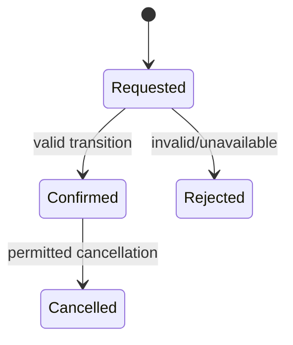
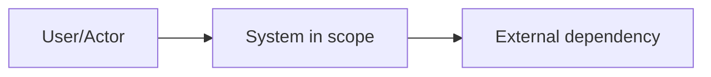
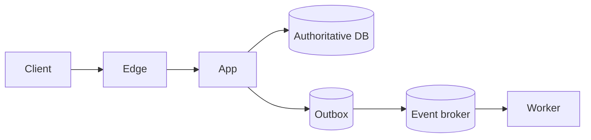
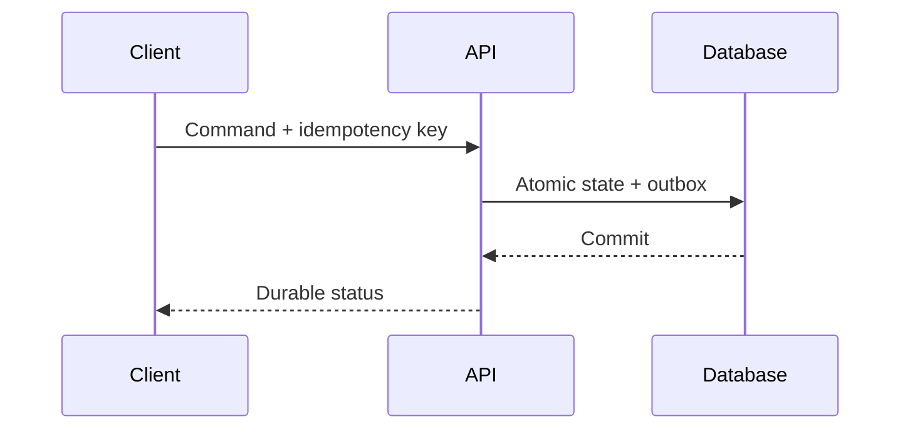

# Architecture Specification: <System or Capability>

> Status: Draft / In review / Accepted / Superseded  
> Owners: <team and accountable owner>  
> Reviewers: <product, security, platform, data, operations, domain>  
> Date: YYYY-MM-DD  
> Decision horizon: <launch / 12 months / long term>  
> Related ADRs/RFCs: <links>

## 1. Decision Summary

### Recommendation

<One concise paragraph describing the selected architecture and scope.>

### Why

- <ASR/invariant/constraint → decision>
- <ASR/invariant/constraint → decision>

### Principal trade-offs

| Benefit | Cost/risk | Why acceptable | Reversal trigger |
|---|---|---|---|

### Decision status

- [ ] Proposed
- [ ] Reviewed
- [ ] Accepted
- [ ] Conditional—open blockers below

## 2. Context and Scope

### Problem and business outcome

<What user/business problem must be solved and how success is measured.>

### Actors and systems

| Actor/system | Role | Trust/ownership boundary | Critical dependency? |
|---|---|---|---|

### In scope

- 

### Non-goals

- 

### Current state

<Measured/confirmed evidence from code, diagrams, incidents, telemetry, contracts, and deployment.>

### Constraints

| Constraint | Type | Source/owner | Design impact |
|---|---|---|---|

### Assumption register

| ID | Assumption | Confidence | Impact if wrong | Validation | Owner/date |
|---|---|---:|---|---|---|

## 3. Requirements and ASRs

### Functional requirements

| ID | Requirement | Priority | Acceptance example |
|---|---|---:|---|

### Architecturally significant requirements

| ID | Journey/attribute | Measure/target | Window/load/geography | Source | Decision links |
|---|---|---|---|---|---|

Cover latency, throughput, availability, durability, consistency/freshness, RTO/RPO, security, privacy, tenancy, residency, operability, cost, and migration where relevant.

### Conflicts and prioritization

| Conflict | Chosen priority | Authority | Consequence |
|---|---|---|---|

## 4. Workload and Capacity Model

### Workload shape

- active users/tenants/devices:
- average and peak requests/events:
- burst factor and duration:
- read/write ratio:
- payload/object-size distribution:
- concurrent connections/jobs:
- fan-out/skew/largest tenant:
- geography/seasonality/growth:

### Calculations

Show formulas and units.

| Dimension | Baseline | Peak | 12-month | Stress | Evidence/assumption |
|---|---:|---:|---:|---:|---|
| RPS/events per second | | | | | |
| Writes/second | | | | | |
| Concurrent work | | | | | |
| Logical storage/day | | | | | |
| Physical retained storage | | | | | |
| Bandwidth/egress | | | | | |
| Queue backlog/drain | | | | | |
| Monthly cost | | | | | |

### Sensitivity and breakpoints

| Variable | Low | Base | High | Architecture breakpoint/action |
|---|---:|---:|---:|---|

## 5. Invariants and State Model

### Critical invariants

| ID | Invariant | Scope | Enforcement point | Reconciliation/repair |
|---|---|---|---|---|

### Entity/aggregate ownership

| Entity/fact | Source of truth | Owner | Transaction boundary | Derived copies |
|---|---|---|---|---|

### State machines

List illegal and ambiguous transitions explicitly.

### Concurrency and consistency

| Operation/read | Isolation/consistency | Ordering scope | Conflict/duplicate behavior | Freshness |
|---|---|---|---|---|

## 6. System Context

Mark trust, tenant, residency, and ownership boundaries. Keep technology detail out of the context view.

## 7. Container and Runtime Architecture

### Component responsibilities

| Component/module | Responsibility | Owner | Protocol | State/data owned | SLO/criticality |
|---|---|---|---|---|---|

### Architecture style and justification

- selected style:
- simpler alternative considered:
- evidence requiring distribution/specialization:
- forbidden coupling/dependency rules:

### Control plane and data plane

<Describe separation, configuration propagation, stale behavior, and authority.>

## 8. Data Architecture

### Data classes and lifecycle

| Data | Classification | Purpose | Store | Retention | Deletion/export | RPO |
|---|---|---|---|---|---|---|

### Store decisions

| Store | Role/source status | Access patterns | Schema/key/index | Consistency/transactions | Partition/replication | Backup/restore | Alternative/trade-off |
|---|---|---|---|---|---|---|---|

### Cache/index/derived views

| View/cache | Source | Freshness | Update/invalidation | Rebuild | Outage/stale behavior |
|---|---|---|---|---|---|

### Schema evolution and migration

<Expand/contract, compatibility window, backfill, validation, cutover, cleanup.>

## 9. API and Event Contracts

### Synchronous APIs

| Operation | Actor | Authz | Idempotency | Deadline/retry | Consistency | Errors | Versioning |
|---|---|---|---|---|---|---|---|

### Events/messages

| Event/topic | Meaning/owner | Key/order | Delivery | Schema/version | Retention/replay | Consumer effect/dedupe |
|---|---|---|---|---|---|---|

### Quotas and limits

| Scope | Rate/burst/concurrency | Fail behavior | Observability |
|---|---|---|---|

## 10. Critical Flows

### Flow A — Success

### Flow A — Timeout, duplicate, and recovery

<Sequence showing ambiguous outcome lookup, duplicate request, dependency failure, retry, reconciliation, and operator repair.>

Repeat for every critical journey.

## 11. Performance and Scaling

### Latency budget

| Stage | p50 budget | p99 budget | Timeout | Optimization/fallback |
|---|---:|---:|---:|---|

### Scaling plan

| Resource/path | Current safe limit | Scaling method | Trigger | Migration/reshard risk |
|---|---:|---|---|---|

### Hot spots and skew

- largest tenant/key/channel:
- celebrity/fan-out behavior:
- temporal hot partitions:
- cross-shard queries/transactions:

### Overload controls

| Resource | Bound/admission | Backpressure/shedding | Degraded mode | Alert |
|---|---|---|---|---|

### Performance validation

<Load, burst, soak, cold cache, backlog, failure injection, pass thresholds.>

## 12. Reliability and Disaster Recovery

### SLIs/SLOs

| Journey | SLI | SLO/window | Error-budget action | Owner |
|---|---|---|---|---|

### Failure matrix

Use `failure-mode-template.md` and summarize highest risks here.

### Redundancy/failover

<Failure domains, quorum/leader/fencing, spare capacity, failback.>

### RTO/RPO

| Capability/data | RTO | RPO | Strategy | Last/proposed drill |
|---|---:|---:|---|---|

### Backup/restore/corruption

<Isolation, encryption/key recovery, retention, PITR, restore order, checks/invariants/reconciliation.>

## 13. Security, Privacy, and Abuse

### Trust/data-flow diagram

<Mark identities, assets, trust boundaries, admin paths, vendors, sensitive data.>

### Threat summary

| Threat/abuse | Asset/impact | Prevent | Detect | Respond/recover | Residual owner |
|---|---|---|---|---|---|

### Identity and authorization

<Human/workload identity, object/function/property/workflow policy, tenant isolation, least privilege.>

### Secrets/encryption

<Key ownership, rotation, TLS, at-rest/field encryption, tokenization, recovery.>

### Privacy/data rights

<Purpose, minimization, consent, retention, delete/export, residency, vendors, backups.>

### Compliance/specialist handoff

<Applicable domains/jurisdictions, unresolved legal/control interpretations, evidence owner.>

## 14. Observability and Operations

### Telemetry

| Journey/component | Logs | Metrics | Traces | Audit | Cardinality/retention |
|---|---|---|---|---|---|

### Alerts and runbooks

| Alert | User/risk signal | Threshold/burn | Action | Runbook/owner |
|---|---|---|---|---|

### Ownership and service catalog

<On-call, escalation, dependency contacts, dashboards, runbooks, cost/DR/security owners.>

## 15. Delivery and Migration

### Build/deploy

<IaC, CI gates, artifacts/provenance, environments, configuration/secrets.>

### Progressive rollout

| Phase | Audience/traffic | Version compatibility | Success/abort | Rollback/roll-forward |
|---|---|---|---|---|

### Data/system migration

| Step | Old/new authority | Write/read behavior | Backfill/CDC | Validation | Abort/cleanup |
|---|---|---|---|---|---|

### Point of no return

<What action makes rollback impossible and what evidence is required before it.>

## 16. Cost and Sustainability

| Driver | Baseline | Growth | Unit cost | Control/alert | Owner |
|---|---:|---:|---:|---|---|

Include compute, storage, operations/IOPS, network/egress, replication, backup, observability, managed services/licenses, AI, and operational staffing.

### Build vs buy / lock-in

| Option | Cost | Risk/lock-in | Operations | Compliance/data | Exit path |
|---|---|---|---|---|---|

## 17. Alternatives and ADRs

| Decision | Selected | Alternatives | Drivers | Consequences | ADR | Reversal trigger |
|---|---|---|---|---|---|---|

## 18. Risks and Open Questions

| ID | Risk/question | Probability | Impact | Mitigation/evidence | Trigger | Owner/due |
|---|---|---:|---:|---|---|---|

Distinguish launch blockers, accepted risk, and follow-up.

## 19. Validation Plan

| Claim/ASR | Test/experiment/drill | Environment/data | Pass condition | Evidence artifact | Owner/date |
|---|---|---|---|---|---|

Include correctness/property, contract, security, load, soak, chaos, migration, backup restore, region failover, and AI evaluation as applicable.

## 20. Implementation Slices

| Slice | User-visible outcome | Risk validated | Components/data | Exit criteria | Rollback |
|---|---|---|---|---|---|

Start with the smallest vertical slice that validates the riskiest architecture assumption. Avoid a big-bang platform build.

## Appendix A — Traceability Matrix

| ASR/invariant | Decision/component | Validation | Telemetry | Owner |
|---|---|---|---|---|

## Appendix B — Review Result

- Score: __ / 100
- Critical gates: __
- Verdict: pass / conditional / block
- Accepted exceptions and authority:
