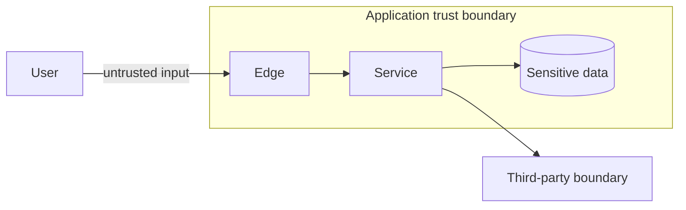

# Threat Model: <System or Capability>

- Owner: <security/product engineering>
- Reviewers: <security, privacy, domain, operations>
- Date/version: YYYY-MM-DD
- Scope: <boundary>
- Related architecture/ADRs: <links>

## 1. Security and Privacy Objectives

- 

## 2. Scope and Assumptions

### In scope

- 

### Out of scope

- 

### Assumptions requiring validation

| Assumption | Impact if false | Validation | Owner |
|---|---|---|---|

## 3. Assets and Data Classification

| Asset/data | Classification | Owner | Impact of disclosure | Impact of tamper/loss | Retention/residency |
|---|---|---|---|---|---|

## 4. Actors and Adversaries

| Actor/adversary | Capability/access | Goal | Trust level |
|---|---|---|---|

Include users, admins/support, workloads, vendors, compromised identities, malicious tenants, supply-chain attackers, and automated abuse.

## 5. Data Flow and Trust Boundaries

Mark authentication, authorization, encryption, tenancy, secrets, admin paths, and data stores.

## 6. Entry Points and Privileged Actions

| Entry/action | Identity | Authn/authz | Input/data | Rate/resource limits | Audit |
|---|---|---|---|---|---|

## 7. Threats and Abuse Cases

| ID | Scenario | Asset/impact | Preconditions | Existing controls | Gap | Risk | Owner |
|---|---|---|---|---|---|---|---|

Cover spoofing, tampering, repudiation, disclosure, denial of service, elevation, object authorization, tenant escape, replay, SSRF/injection, supply chain, insider/admin abuse, fraud, and AI-specific threats where applicable.

## 8. Control Plan

| Threat ID | Prevent | Detect | Respond/contain | Recover/reconcile | Validation |
|---|---|---|---|---|---|

## 9. Identity and Authorization Model

- human/workload/device identities:
- tenant context source/propagation:
- object/function/property/workflow policy:
- least privilege and separation of duties:
- admin/support/break-glass:
- session/token rotation/revocation:

## 10. Data Protection and Privacy

- minimization/purpose/consent:
- TLS/at-rest/field encryption and key ownership:
- logging/redaction:
- retention/deletion/export:
- search/vector/cache/backup propagation:
- residency/vendor processors:

## 11. Supply Chain and Delivery

- dependency/SBOM/provenance:
- CI/build credentials:
- artifact signing/registry:
- patch/vulnerability process:
- configuration/secrets rollout:

## 12. Incident Response

- detection/alerting:
- containment/revocation:
- evidence/forensics:
- customer/regulatory communication path:
- recovery/reconciliation:
- tabletop date/owner:

## 13. Residual Risk and Acceptance

| Risk | Probability | Impact | Residual controls | Accepting authority | Review/trigger |
|---|---:|---:|---|---|---|

## 14. Verification Plan

| Test/review | Threat/control | Pass condition | Environment | Owner/date |
|---|---|---|---|---|
