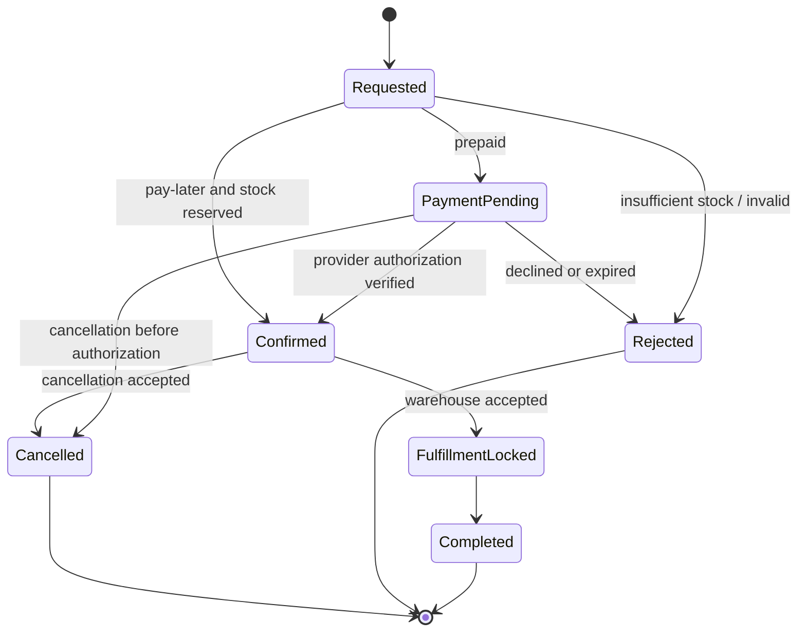
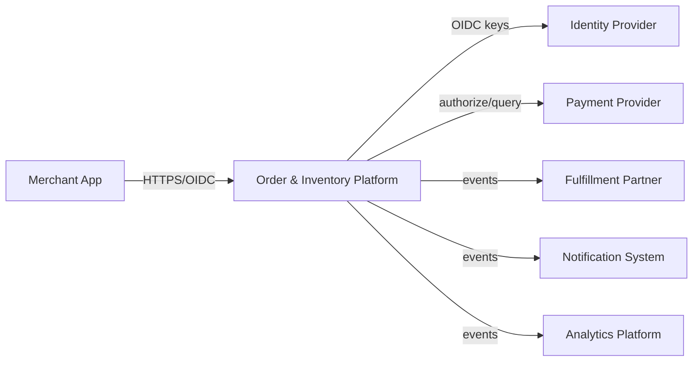
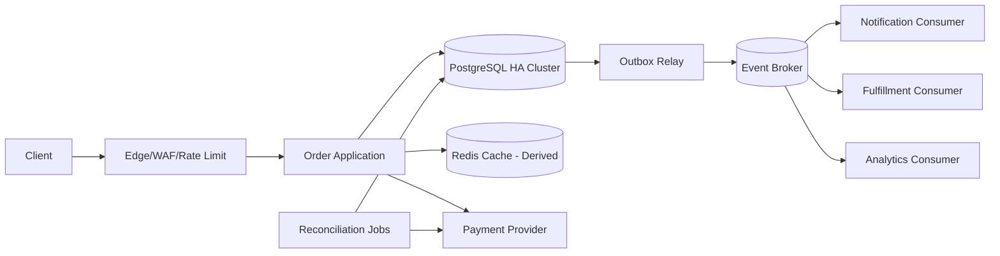
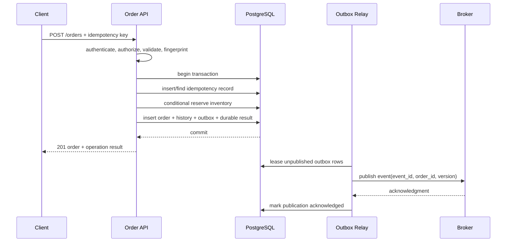
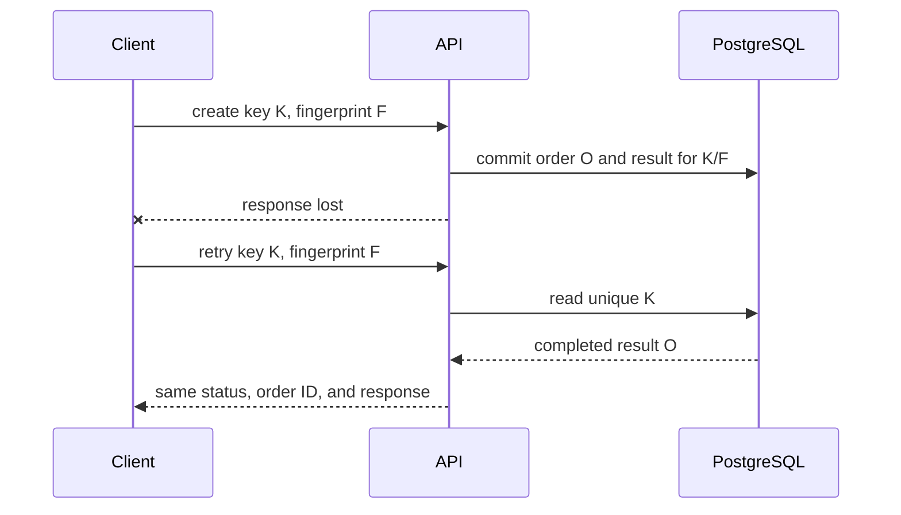

# Architecture Specification: Multi-Tenant Order and Inventory Platform

> Status: Example — blocked pending launch evidence
> Owners: Commerce Platform team  
> Reviewers: Product, Security, SRE, Finance Operations, Data  
> Decision horizon: launch through 18 months  
> This is a fictional worked example. Numbers are assumptions chosen to demonstrate the method.

## 1. Decision Summary

### Recommendation

Build a region-local modular monolith for order capture and inventory reservation, backed by PostgreSQL as the authoritative transactional store. Commit the order, reservation, immutable status history, idempotency record, and transactional outbox in one database transaction. Publish post-commit events through an outbox relay to a broker for notifications, analytics, search indexing, and integrations. Use Redis only for rebuildable read acceleration and short-lived coordination; it is never the source of truth.

Deploy stateless application instances across three availability zones behind a regional load balancer. Begin in one primary region with encrypted cross-region backups and a warm recovery environment. Adopt active-active regions only when measured geography or recovery requirements justify the consistency and operational cost.

### Why

- **INV-01 no oversell** requires atomic stock reservation with the order decision.
- **INV-02 one semantic order per tenant/idempotency key** requires durable idempotency in the same authority as the order.
- Peak load of 2,000 create-order RPS fits one well-partitioned relational authority with headroom; independent databases and distributed transactions are not yet justified.
- Notifications and analytics can tolerate seconds of propagation lag and should not extend the checkout critical path.
- The team of six backend engineers can own one deployable with explicit modules more safely than many independently operated services.

### Principal trade-offs

| Benefit | Cost / risk | Why acceptable | Reversal trigger |
|---|---|---|---|
| Local ACID transaction protects order and inventory invariants | Primary database is a major dependency | Multi-zone HA, bounded workload, recovery drills, and graceful read degradation reduce risk | Sustained write saturation, incompatible locality, or independently governed inventory domains |
| Modular monolith minimizes distributed failure modes | Modules cannot scale independently at first | Application is stateless; workers and read paths can scale separately | One module consumes >40% resources or requires a materially different SLO/change cadence |
| Asynchronous side effects keep checkout fast | Consumers observe eventual consistency and duplicates | Contracts, inbox dedupe, replay, lag SLOs, and reconciliation are explicit | A side effect becomes legally atomic with order acceptance |
| Single primary region simplifies correctness | Regional outage needs failover and may lose up to RPO | Business accepts 60-minute RTO and 5-minute RPO for launch | Revenue/geography requires lower RTO/RPO and funds multi-region write coordination |

### Decision status

- [x] Proposed
- [x] Reviewed
- [ ] Fully accepted
- [x] Blocked: load, restore, and payment-sandbox ambiguity tests must pass before launch

## 2. Context and Scope

### Problem and business outcome

Merchants need to create orders against finite stock without overselling, retrieve status quickly, and connect notifications, analytics, and fulfillment systems. Success means a merchant can submit an order once, receive a durable and unambiguous result, and trust that reserved inventory and downstream records converge correctly.

### Actors and systems

| Actor / system | Role | Trust / ownership boundary | Critical dependency? |
|---|---|---|---:|
| Merchant application | Creates and reads orders | External client; untrusted input | Yes |
| Order platform | Owns order lifecycle and stock reservations | System in scope | Yes |
| Identity provider | Issues workforce/customer tokens | External security boundary | Yes for new sessions; cached keys for validation |
| Payment provider | Authorizes payment | External vendor | Yes for prepaid checkout |
| Notification provider | Sends email/SMS/push | External vendor | No; asynchronous |
| Analytics warehouse | Business reporting | Separate data boundary | No; asynchronous |
| Fulfillment integration | Receives accepted orders | Partner boundary | No; asynchronous with lag objective |

### In scope

- Order creation, cancellation, read, and status history
- Stock reservation and release
- Durable idempotency and ambiguous-result lookup
- Payment authorization orchestration for prepaid orders
- Event publication and downstream integration contracts
- Operational, security, migration, recovery, and cost controls

### Non-goals

- Warehouse route optimization
- General ledger and settlement accounting
- Dynamic pricing engine
- Global active-active writes at launch
- Arbitrary customer-authored workflow execution

### Current state

A prototype directly writes an `orders` table and publishes to a broker after commit. It has no durable idempotency record, no reconciliation job, and no tested backup restore. The architecture replaces the unsafe database-plus-broker dual write and establishes measurable launch gates.

### Constraints

| Constraint | Type | Source / owner | Design impact |
|---|---|---|---|
| Six backend engineers and shared on-call | Organization | Engineering director | Prefer one deployable and managed infrastructure |
| Launch in one jurisdiction | Residency | Product/legal | Primary data remains in chosen region |
| Existing PostgreSQL expertise | Skills | Team | Relational authority lowers delivery and incident risk |
| Payment provider p99 can reach 1.2 seconds | Dependency | Vendor telemetry | Separate API deadline, timeout, lookup, and reconciliation paths |
| Launch budget ceiling: $18,000/month | Cost | Product owner | Capacity and observability have budget alerts |

### Assumption register

| ID | Assumption | Confidence | Impact if wrong | Validation | Owner / date |
|---|---|---:|---|---|---|
| A-01 | Peak create-order traffic is ≤2,000 RPS for 10 minutes | Medium | DB and payment paths overload | Replay production-shaped load at 3,000 RPS for 30 minutes | Performance owner / pre-launch |
| A-02 | Largest tenant is ≤8% of write traffic | Low | Hot tenant degrades shared service | Tenant-key telemetry and skew test at 20% | SRE / beta |
| A-03 | Notifications tolerate 60 seconds lag | High | User communication delay | Product approval and lag alert | Product / design review |
| A-04 | RTO 60 minutes and RPO 5 minutes are acceptable | Medium | Outage loss exceeds tolerance | Business-impact review and recovery drill | Product + SRE / launch |

## 3. Requirements and Architecturally Significant Requirements

### Functional requirements

| ID | Requirement | Priority | Acceptance example |
|---|---|---:|---|
| FR-01 | Create an order with one or more items | Must | Valid stock and payment produce a durable order ID |
| FR-02 | Retry safely after client timeout | Must | Same semantic request returns the same order/result |
| FR-03 | Cancel before fulfillment lock | Must | Reservation is released exactly once |
| FR-04 | Read order status and history | Must | Authorized tenant sees its own order only |
| FR-05 | Publish accepted/cancelled events | Must | Consumers can deduplicate, replay, and rebuild views |

### Architecturally significant requirements

| ID | Journey / attribute | Measure / target | Window / load / geography | Decision links |
|---|---|---|---|---|
| ASR-01 | Create order latency | p95 ≤300 ms and p99 ≤700 ms excluding external payment; total prepaid p99 ≤2 s | 2,000 RPS peak in primary region | Local transaction, deadline budget |
| ASR-02 | Read order latency | p99 ≤200 ms | 8,000 RPS peak | Indexed primary/read replica, optional cache |
| ASR-03 | Availability | 99.95% successful valid create requests monthly | Region available; vendor exclusions separately measured | Multi-zone, overload controls |
| ASR-04 | Durability | No acknowledged order or reservation loss | All accepted writes | Synchronous multi-zone commit, restore/reconciliation |
| ASR-05 | Correctness | No confirmed order exceeds available stock; duplicate semantic request creates ≤1 order | All traffic and replays | Row locking/conditional update, idempotency |
| ASR-06 | Event propagation | 99.9% accepted order events published within 30 s; no loss | Normal operation | Transactional outbox, relay lag SLI |
| ASR-07 | Recovery | RTO ≤60 min; RPO ≤5 min | Regional disaster | PITR, cross-region copy, warm environment |
| ASR-08 | Tenant isolation | Zero cross-tenant reads/writes; authorization checked on every action | All APIs and jobs | Tenant-scoped keys and policies |
| ASR-09 | Cost | ≤$0.004 platform infrastructure per accepted order at forecast volume | Monthly | Unit-cost dashboard and budget alert |

### Conflicts and prioritization

| Conflict | Chosen priority | Authority | Consequence |
|---|---|---|---|
| Availability vs stock correctness during partition | Correctness | Product + engineering | Reject/defer writes rather than oversell |
| Fast response vs synchronous notification | Fast durable order response | Product | Notification is asynchronous |
| Global write availability vs operational simplicity | Launch simplicity | Engineering director | Regional failover rather than active-active |

## 4. Workload and Capacity Model

### Workload shape

- 25,000 merchant tenants; 4,000 active in peak hour.
- 20 million orders/month baseline; 60 million/month 18-month high case.
- 2,000 create-order RPS peak for 10 minutes; 3,000 RPS stress target.
- 8,000 read RPS peak; read/write ratio approximately 4:1.
- Average 3 line items/order; p99 40 items; hard limit 100.
- Average command payload 4 KiB; average read response 7 KiB.
- Largest tenant assumption 8% of writes; explicit per-tenant quotas prevent monopoly.
- Event fan-out: four core consumer groups, each receiving every accepted-order event.

### Calculations

- Baseline average order rate: `20,000,000 / (30 × 86,400) ≈ 7.7 orders/s`.
- Peak-to-average factor: `2,000 / 7.7 ≈ 260`; capacity must follow the burst, not the average.
- Peak line-item mutations: `2,000 × 3 average = 6,000 item reservations/s`; stress target is `3,000 × 5 test average = 15,000/s`.
- Logical order data/day: `20,000,000 / 30 × 7 KiB ≈ 4.7 GiB/day`, before indexes, history, outbox, and replicas.
- With 4× physical multiplier and 400-day retention: `4.7 × 4 × 400 ≈ 7.5 TiB` at baseline.
- Broker ingress at peak: `2,000 × 2 KiB ≈ 4 MiB/s`; consumer delivery multiplies network, not authoritative storage.
- Backlog after 15-minute consumer outage at 2,000 events/s: `1.8 million events`. At 6,000 events/s drain, recovery takes `1.8M / (6,000−2,000) = 450 s` while traffic continues.

| Dimension | Baseline | Peak | 18-month high | Stress | Evidence / assumption |
|---|---:|---:|---:|---:|---|
| Create order RPS | 7.7 avg | 2,000 | 4,000 | 3,000 launch test | Forecast A-01 |
| Read RPS | 31 avg | 8,000 | 16,000 | 12,000 | 4:1 read/write |
| Item mutations/s | 23 avg | 6,000 | 20,000 | 15,000 | item distribution |
| Logical order storage/day | 4.7 GiB | same daily total with bursts | 14 GiB | N/A | payload estimate |
| Physical retained storage | 7.5 TiB | N/A | 22.5 TiB | restore subset | 4× multiplier |
| Broker ingress | low avg | 4 MiB/s | 8 MiB/s | 6 MiB/s | 2 KiB/event |
| Monthly infrastructure | $11,000 | $14,000 provisioned | $26,000 | $18,000 launch ceiling | pricing estimate |

### Sensitivity and breakpoints

| Variable | Low | Base | High | Architecture breakpoint / action |
|---|---:|---:|---:|---|
| Peak create RPS | 1,000 | 2,000 | 8,000 | Partition orders by tenant/time only after measured write or maintenance pressure |
| Largest tenant share | 2% | 8% | 30% | Isolate tenant workload or dedicated shard when quotas are insufficient |
| Average line items | 2 | 3 | 20 | Batch/locking strategy and transaction duration must be retested |
| Regional RTO | 4 h | 60 min | 5 min | Warm recovery is insufficient; fund hot standby and automated failover |

## 5. Invariants and State Model

### Critical invariants

| ID | Invariant | Scope | Enforcement point | Reconciliation / repair |
|---|---|---|---|---|
| INV-01 | Confirmed + reserved quantity never exceeds available stock | SKU + warehouse | Atomic conditional reservation transaction | Inventory/order reconciliation; block affected SKU on mismatch |
| INV-02 | `(tenant_id, idempotency_key)` maps to one semantic command and one durable result | Tenant | Unique constraint + request fingerprint | Return prior result; reject key reuse with different fingerprint |
| INV-03 | An order has one legal state at a time and only listed transitions occur | Order | Conditional state update with expected version | Audit history replay and repair tool |
| INV-04 | Releasing a reservation cannot increase stock more than the original reservation | Reservation | Immutable reservation amount + one release transition | Recompute from reservation journal |
| INV-05 | An outbox event describes committed authoritative state | Database transaction | State and outbox committed together | Relay replay and event-to-source comparison |
| INV-06 | Every tenant-scoped record is read and written under the authenticated tenant | All data | Repository policy + composite keys + tests | Security incident procedure |

### Entity / aggregate ownership

| Entity / fact | Source of truth | Owner | Transaction boundary | Derived copies |
|---|---|---|---|---|
| Order and status history | PostgreSQL order module | Commerce team | Order transaction | Search, analytics, cache |
| Stock balance and reservations | PostgreSQL inventory module | Commerce team at launch | Reservation transaction with order | Warehouse read model |
| Idempotency result | PostgreSQL idempotency table | Commerce team | Same order transaction | None |
| Published integration event | PostgreSQL outbox until acknowledged | Commerce team | Same order transaction | Broker topics |
| Notification delivery | Notification consumer store | Messaging team | Consumer-local transaction | Provider records |

### State machines



Illegal transitions include `Completed → Cancelled`, `Rejected → Confirmed`, and any second terminal transition. Provider callbacks never directly force a transition; they submit a version-checked command evaluated against current state.

### Concurrency and consistency

| Operation / read | Isolation / consistency | Ordering scope | Conflict / duplicate behavior | Freshness |
|---|---|---|---|---|
| Reserve item | Row lock or conditional decrement in transaction | SKU/warehouse | One succeeds; loser receives insufficient/conflict and may retry command | Immediate |
| Create order | Transactional | Tenant/idempotency key | Same fingerprint returns stored result; different fingerprint returns conflict | Immediate |
| Cancel order | Optimistic version + reservation transaction | Order | Duplicate cancellation returns current terminal result | Immediate |
| Order read | Primary or replica with read-your-write token | Order | Client may request primary after mutation | Replica lag ≤2 s otherwise primary |
| Analytics | Eventual | Event key/order ID | Consumer dedupe; late data upsert | ≤5 min |

## 6. System Context



The merchant, vendors, and partner systems are separate trust boundaries. Tenant identity is propagated as a verified claim but re-authorized against the requested resource. Payment data is tokenized by the provider; the platform does not store raw card data.

## 7. Container and Runtime Architecture



### Component responsibilities

| Component / module | Responsibility | Owner | Protocol | State owned | SLO / criticality |
|---|---|---|---|---|---|
| Edge | TLS termination, WAF, coarse quotas, request size | Platform | HTTPS | Rules/config | Critical |
| Order API | Authz, validation, state machine, orchestration | Commerce | HTTPS/internal calls | None outside transaction | Critical |
| Inventory module | Reservation and release invariants | Commerce | In-process interface | Inventory tables | Critical |
| Payment adapter | Provider token/API normalization and lookup | Commerce | HTTPS | Provider reference only | Critical for prepaid |
| PostgreSQL | Orders, inventory, idempotency, outbox, audit | Database platform | SQL/TLS | Authoritative state | Critical |
| Outbox relay | Lease, publish, mark acknowledgment, lag metrics | Commerce | SQL + broker | Relay cursor/lease | Important |
| Broker | Durable integration delivery and replay | Platform | Event protocol | Event log | Important; not order authority |
| Redis | Rebuildable reads and short cache | Platform | TLS | Derived only | Optional/degradable |
| Reconciliation | Detect/repair provider and event divergence | Finance ops | Scheduled jobs | Checkpoint/results | Critical control |

### Architecture style and justification

The selected style is a modular monolith with asynchronous integration. Modules expose in-process contracts and cannot access another module's tables except through approved repositories. Distribution is deferred because one team owns the consistency boundary, the write load is feasible, and independent deployment would introduce more failure modes than value.

Forbidden coupling:

- Consumer systems may not query order database tables directly.
- Cache or broker state may not authorize or reconstruct an accepted order without the authoritative database.
- API handlers may not publish directly to the broker after committing business state.
- Notification or analytics failure may not roll back an accepted order.

### Control plane and data plane

Configuration, quotas, feature flags, schemas, and rollout policies form the control plane. Cached configuration has a signed version, expiry, last-known-safe fallback, and audit record. Order commands and reads form the data plane; a control-plane outage must not invalidate already loaded safe configuration or grant broader access.

## 8. Data Architecture

### Data classes and lifecycle

| Data | Classification | Purpose | Store | Retention | Deletion / export | RPO |
|---|---|---|---|---|---|---:|
| Order business record | Confidential tenant data | Fulfillment and support | PostgreSQL | 400 days online, policy archive after | Tenant export; legal deletion policy | 5 min |
| Payment token/reference | Restricted | Authorization/reconciliation | PostgreSQL encrypted column | Required transaction period | Provider and policy coordinated | 5 min |
| Audit/status history | Confidential / audit | Evidence and repair | Append-only table + archive | 7 years where required | Controlled legal process | 5 min |
| Idempotency record | Confidential metadata | Duplicate safety | PostgreSQL | Maximum client replay + 7 days | Automatic expiry after terminal retention | 5 min |
| Integration events | Confidential | Downstream processing | Broker | 14 days replay | Topic-level policy and subject workflow | N/A; rebuild from outbox/source |
| Cache entries | Derived | Read performance | Redis | ≤5 minutes | Expiry/invalidation | 0; rebuild |

### Store decisions

| Store | Role / source status | Access patterns | Schema / key / index | Consistency / transactions | Partition / replication | Backup / restore | Alternative / trade-off |
|---|---|---|---|---|---|---|---|
| PostgreSQL | Authoritative | Point order, tenant history, SKU reservation | Composite tenant keys; unique idempotency; SKU/warehouse index | Local ACID, version checks | Multi-zone primary/standby; later tenant partition | PITR + cross-region copies + restore drill | NoSQL offers scale but weaker fit for multi-record invariants |
| Redis | Derived cache | Hot order reads, short auth/config cache | Tenant+order key; bounded TTL | Eventual; never authoritative | Replicated within region | No business restore required | Remove entirely if hit rate/cost weak |
| Event broker | Durable integration log | Append, consumer group, replay | Order ID key; schema registry | At-least-once application semantics | Multi-zone partitions | Provider retention; source replay | Direct webhooks simpler but poorer fan-out/replay |
| Object storage | Archive/export | Large immutable exports | Tenant/date prefix | Read-after-write per provider | Multi-zone, cross-region policy | Versioning and restore test | DB blobs increase cost and backup time |

Partitioning is not introduced on day one. The schema keeps tenant and time fields needed for future partitioning. The trigger is sustained table/index maintenance or write capacity pressure demonstrated by measurement, not record count alone.

All order totals, taxes, discounts, and provider amounts use integer minor units or a fixed-precision decimal type together with an explicit ISO currency code. Conversion and rounding rules are versioned at the pricing boundary; binary floating-point is prohibited for persisted or compared monetary values.

### Cache, index, and derived views

| View / cache | Source | Freshness | Update / invalidation | Rebuild | Outage / stale behavior |
|---|---|---|---|---|---|
| Order read cache | PostgreSQL | TTL ≤60 s; mutation invalidation | Best-effort delete after commit + TTL | Lazy read | Bypass to DB; never return cross-tenant data |
| Fulfillment view | Order events | p99 lag ≤30 s | Idempotent consumer | Replay from retained events/source export | Show delayed status; alert on lag |
| Analytics facts | Order events | ≤5 min | Upsert by event/version | Replay/backfill | Reports marked delayed |

### Schema evolution and migration

Use expand/migrate/contract:

1. Add nullable/new columns and indexes with online-safe operations.
2. Deploy readers/writers compatible with old and new shapes.
3. Backfill in restartable, tenant-bounded chunks with checkpoint, rate limit, and invariant comparison.
4. Switch reads behind a feature flag after shadow validation.
5. Stop old writes, observe compatibility window, then remove old fields in a later release.

No application-level blind dual write is allowed. CDC or transactional outbox is used when state must propagate.

## 9. API and Event Contracts

### Synchronous APIs

| Operation | Actor | Authz | Idempotency | Deadline / retry | Consistency | Errors | Versioning |
|---|---|---|---|---|---|---|---|
| `POST /orders` | Merchant | tenant + `order:create` + item scope | Required header; fingerprint stored | 2.2 s total; client retries only after lookup or same key | Durable transaction result | Stable problem codes: invalid, insufficient stock, conflict, provider unavailable | Additive v1; breaking via new major |
| `GET /orders/{id}` | Merchant/support | resource tenant and role | N/A | 500 ms; retry safe | Replica unless read-your-write token/lag breach | not found masks unauthorized existence | v1 |
| `POST /orders/{id}/cancel` | Merchant/support | tenant + state/action policy | Required | 1 s; same key safe | Version-checked transaction | terminal/conflict codes | v1 |
| `GET /operations/{key}` | Merchant | tenant + idempotency ownership | N/A | 500 ms | Authoritative result | pending/complete/failed | v1 |

API errors use stable machine-readable codes, correlation IDs, safe detail, and explicit retryability. A timeout does not imply failure; clients retry with the same idempotency key or query operation status.

### Events and messages

| Event / topic | Meaning / owner | Key / order | Delivery | Schema / version | Retention / replay | Consumer effect / dedupe |
|---|---|---|---|---|---|---|
| `order.confirmed.v1` | Order reached Confirmed | order ID; ordered per order | At-least-once | Backward-compatible schema | 14 days + source export | Inbox `(consumer,event_id)`; upsert version |
| `order.cancelled.v1` | Cancellation committed | order ID | At-least-once | v1 | 14 days | Idempotent release already authoritative; downstream compensates locally |
| `order.fulfillment-locked.v1` | Warehouse accepted handoff | order ID | At-least-once | v1 | 14 days | Dedupe and reject stale version |

Every event includes event ID, aggregate ID/version, tenant, occurred/published times, causation/correlation IDs, trace context, schema version, and minimal non-sensitive payload. Consumers must not infer exactly-once execution from the broker.

### Quotas and limits

| Scope | Rate / burst / concurrency | Failure behavior | Observability |
|---|---|---|---|
| Tenant order creates | Contract tier; default 50 RPS, burst 200, max 100 in-flight | `429` with retry hint before DB saturation | accepted/rejected by tenant/tier |
| Global create | Admission limit tied to DB and payment capacity | Shed low-priority/bulk traffic; preserve status lookup | saturation and shed SLI |
| Order line items | 100 hard maximum | Validation error | payload rejection metric |
| Broker backlog | Per-consumer bounded retention and lag thresholds | Pause producer only for mandatory safety consumers; otherwise isolate consumer | lag, age, DLQ, replay rate |

## 10. Critical Flows

### Flow A — Pay-later order success



The response is returned after authoritative commit, not after notification or fulfillment. Relay publication can repeat; consumers deduplicate.

### Flow B — Client timeout and duplicate



If key K is reused with a different fingerprint, the API returns a non-retryable idempotency conflict. A key in `processing` has a lease/owner and expiry; takeover first proves the previous transaction did not commit. There is no unlocked “try again and hope” path.

### Flow C — Prepaid order with ambiguous provider timeout

```mermaid
sequenceDiagram
  participant C as Client
  participant A as API
  participant D as PostgreSQL
  participant P as Payment Provider
  participant Q as Reconciler
  C->>A: create prepaid order K
  A->>D: reserve stock + PaymentPending + provider request key
  A->>P: authorize(provider idempotency key)
  P--xA: timeout / result unknown
  A->>D: keep PaymentPending; record attempt
  A-->>C: 202 operation pending
  Q->>P: query by provider key
  P-->>Q: authorized
  Q->>D: version-checked transition to Confirmed + outbox
  C->>A: GET operation K
  A-->>C: Confirmed
```

The system never issues a new provider semantic key merely because the response timed out. Reconciliation queries the provider, then applies a legal transition. If authorization is definitively absent after expiry, stock is released and the order becomes Rejected.

### Flow D — Cancellation racing fulfillment

Both commands use the current order version in a conditional transaction. Exactly one legal transition wins. The loser receives the current state and does not repeat inventory effects. External consumers use event version to reject stale messages.

### Flow E — Relay or consumer failure

- Relay outage: committed outbox rows accumulate; order writes continue while lag remains below capacity threshold.
- Broker acknowledgment ambiguity: relay republishes the same event ID.
- Poison consumer message: bounded retries, then quarantine with alert and replay tooling.
- Consumer recovery: process retained log from checkpoint; inbox prevents duplicate effects.
- Outbox cleanup: delete only after publication acknowledgment and retention window; archive enough metadata for audit.

## 11. Performance and Scaling

### Latency budget

| Stage | p50 budget | p99 budget | Timeout | Optimization / fallback |
|---|---:|---:|---:|---|
| Edge + TLS + auth token validation | 15 ms | 50 ms | 100 ms | Cached IdP keys with bounded refresh |
| API validation and policy | 10 ms | 30 ms | 50 ms | Precompiled validators, bounded payload |
| DB transaction, pay-later | 60 ms | 350 ms | 500 ms | Short transaction, correct indexes, no remote side effects |
| Payment provider | 300 ms | 1,200 ms | 1,400 ms | Pending result + lookup/reconciliation |
| Response/network reserve | 50 ms | 270 ms | End-to-end 2,200 ms | Return durable pending/result |

Timeouts decrease down the call chain and fit inside the client deadline. Retries are bounded, use backoff/jitter, and consume a retry budget; no layer independently multiplies attempts.

### Scaling plan

| Resource / path | Current safe limit | Scaling method | Trigger | Migration / reshard risk |
|---|---:|---|---|---|
| Stateless API | 3,000 create RPS tested | Horizontal instances; autoscale on queue/concurrency and latency | 60% sustained safe concurrency | Connection storms; use pool budgets |
| PostgreSQL writes | Test-derived TPS and lock threshold | Vertical headroom, query/index work, then tenant/time partition | p99 lock/commit or WAL saturation | Repartition/backfill; tenant skew |
| Reads | Replica safe QPS | Read replicas and bounded cache | replica CPU/lag or DB read cost | stale reads; read-your-write routing |
| Outbox relay | 10,000 events/s target | Partition leases/workers by outbox key | oldest age >10 s | duplicate publication, DB scan cost |
| Consumer groups | 6,000 events/s/group | Partitions and workers | drain time exceeds objective | key/order constraints |

### Hot spots and skew

- Tenant quota and per-tenant concurrency protect shared resources.
- Inventory rows for flash-sale SKUs can become hot. Use atomic conditional update, waiting-time cap, stock segmentation only after measurement, and a waiting-room/admission strategy for exceptional campaigns.
- Sequential time-only indexes are monitored for write concentration; identifiers are not used as a partitioning substitute.
- A p99 40-item order sorts reservation keys before lock acquisition to reduce deadlock risk and caps transaction duration.

### Overload controls

| Resource | Bound / admission | Backpressure / shedding | Degraded mode | Alert |
|---|---|---|---|---|
| API concurrency | Global + tenant semaphore | Reject before DB with retry hint | Reads/status preserved; bulk writes shed first | saturation and rejection burn |
| DB connections | Fixed pool per instance and global budget | Queue briefly inside deadline; no unbounded waiter | Read cache/replica for eligible reads | pool wait p99, DB connections |
| Payment provider | Circuit/adaptive concurrency | New prepaid requests return unavailable/pending by policy | Pay-later unaffected | timeout/error/window |
| Outbox | Storage/age budget | Throttle nonessential event enrichment | Orders continue until safety threshold; then controlled admission | oldest age, row count, disk |
| Consumer queue | Bounded retention and lag | Pause/quarantine poison work; add workers | Downstream marked delayed | age, DLQ, drain ETA |

### Performance validation

- 3,000 create RPS for 30 minutes with production-shaped tenant/SKU skew.
- 12,000 read RPS with cold and warm caches.
- 2× burst for 60 seconds without retry storm or invariant violation.
- 8-hour soak at 60% capacity checking connection, memory, table/index, and outbox growth.
- Broker outage for 15 minutes followed by drain while peak traffic continues.
- Payment latency distribution and 5% timeout fault injection.
- Pass only if SLO thresholds hold, error cause is controlled shedding rather than collapse, and invariant reconciliation is exact.

## 12. Reliability and Disaster Recovery

### SLIs and SLOs

| Journey | SLI | SLO / window | Error-budget action | Owner |
|---|---|---|---|---|
| Create valid order | Durable valid responses / eligible attempts | 99.95% monthly | Fast burn pages; repeated burn freezes risky rollout | Commerce/SRE |
| Create latency | Requests under journey threshold / eligible requests | 99% under 700 ms pay-later; separate prepaid objective | Capacity and dependency investigation | Commerce |
| Event propagation | Events published within 30 s / committed events | 99.9% rolling 30 days | Relay capacity/incident response | Commerce |
| Recovery readiness | Successful restore/failover drills | 100% quarterly drills within RTO/RPO | Block launch/major change if overdue | SRE |
| Correctness | Reconciliation mismatches | Zero uncontained oversell or duplicate order | Immediate incident and write containment | Commerce/Product |

### Failure matrix summary

| Failure | Containment and behavior | Repair / evidence |
|---|---|---|
| One API instance dies | Load balancer removes it; in-flight client retries with same key | Idempotency result proves outcome |
| DB primary fails | Managed failover; writes pause within deadline; no app retry storm | Transaction integrity check and SLO review |
| Redis unavailable | Bypass cache with protected DB concurrency | Cache rebuild; no correctness repair |
| Broker unavailable | Outbox accumulates within bounded storage/age budget | Relay drains; compare committed/outbox/published counts |
| Payment timeout | Durable Pending; lookup and reconciliation | Provider-key report vs internal states |
| Region unavailable | Declare disaster, restore/promote warm environment, controlled DNS/traffic switch | Restore validation, invariant checks, provider reconciliation |
| Bad deployment | Progressive gate aborts; rollback compatible version | Contract/schema and user-journey validation |
| Credential compromise | Revoke identity/secret, stop high-risk actions, rotate, inspect audit | Security incident process |

### Redundancy and failover

Application and broker nodes span three zones. PostgreSQL uses synchronous regional standby according to provider semantics. Every leader/lease-based process uses fencing or compare-and-set ownership; timeouts alone do not prove ownership loss. Spare capacity permits one-zone loss without exceeding 70% tested capacity.

### RTO and RPO

| Capability / data | RTO | RPO | Strategy | Drill |
|---|---:|---:|---|---|
| Order writes and reads | 60 min | 5 min | Cross-region PITR/copy + warm IaC environment | Quarterly full restore and traffic rehearsal |
| Event consumers | 4 h | 0 from authoritative source within retention | Replay broker or regenerate from outbox/source export | Quarterly replay |
| Cache | 15 min performance recovery | N/A | Rebuild lazily | During game day |
| Audit archive | 8 h | 24 h archive copy; online source 5 min | Versioned object storage + DB restore | Semiannual |

### Backup, restore, and corruption

Backups are encrypted under keys whose recovery path is tested separately. Copies are isolated from the primary administrative account. Restore order is infrastructure and identity, database, schemas/configuration, application in read-only validation mode, invariant/reconciliation checks, then controlled traffic. A successful snapshot job is not counted as recovery evidence; the quarterly drill must restore into an isolated environment, verify row/checksum samples and domain invariants, replay events, and record achieved RTO/RPO.

## 13. Security, Privacy, and Abuse

### Trust and data flow

Trust boundaries exist at client/edge, identity provider, payment provider, broker consumers, support/admin access, CI/CD, and recovery accounts. Every boundary uses authenticated workload identity, encrypted transport, explicit authorization, bounded input, and auditable policy decisions.

### Threat summary

| Threat / abuse | Asset / impact | Prevent | Detect | Respond / recover | Residual owner |
|---|---|---|---|---|---|
| Cross-tenant object access | Confidentiality/integrity | Tenant in authenticated context and every key; resource/action policy | Denied-access and canary tests | Revoke, investigate audit, notify per policy | Security + Commerce |
| Credential stuffing / automated order spam | Capacity/fraud | Edge rate limits, risk signals, MFA where applicable | auth failure patterns, tenant burst | Challenge/block, rotate, incident | Security |
| Idempotency-key probing | Order metadata | High-entropy client key, tenant scope, no existence leak | conflict and enumeration patterns | Block and investigate | Commerce |
| SSRF through integration URL | Internal network/secrets | Allowlist, DNS/IP revalidation, egress proxy, metadata denial | egress logs/anomalies | Disable integration, rotate affected secrets | Security |
| Broker consumer over-privilege | Tenant/event disclosure | Topic ACL, workload identity, minimal payload | audit and access anomalies | Revoke identity, replay after correction | Platform |
| Admin cancels legitimate orders | Integrity/fraud | Least privilege, reason, step-up auth, separation for bulk action | tamper-evident audit and anomaly alerts | Suspend account, reconcile, incident | Operations |
| Sensitive data in telemetry | Privacy/compliance | Structured allowlist/redaction; no raw tokens/payment data | scanning and sampling | purge where feasible, rotate, report | Privacy owner |

### Identity and authorization

- Validate signed tokens locally with bounded key cache and fail-safe refresh rules.
- Authorize action, tenant, resource ownership, current workflow state, and sensitive fields—not merely endpoint access.
- Service-to-service calls use workload identity with per-capability scopes; shared static credentials are prohibited.
- Support impersonation is explicit, time-bound, bannered, reasoned, and audited; destructive actions require step-up authentication.
- Database roles separate application, migration, relay, read-only support, and backup permissions.

### Secrets and encryption

TLS protects all external and internal connections. Managed keys encrypt database, backups, broker, and object storage. Restricted provider references receive field-level protection where useful. Rotation defines overlap, re-encryption, revocation, disaster access, and an owner. Secrets never appear in repository, image, telemetry, event payload, or support export.

### Privacy and data rights

Collect only data required for order execution and support. Purpose, legal basis/consent where applicable, residency, retention, export, correction, and deletion are recorded per data class. Deletion is a workflow across source, derived views, broker retention, object exports, vendors, and backups; backup expiry and restore-time re-deletion are defined. Analytics events use minimum fields and tenant-scoped pseudonymous identifiers when possible.

### Compliance and specialist handoff

Payment scope, financial record retention, tax, privacy jurisdiction, and breach obligations require legal/compliance confirmation. Architecture records the technical controls and unresolved interpretations; it does not substitute for specialist approval.

## 14. Observability and Operations

### Telemetry

| Journey / component | Logs | Metrics | Traces | Audit | Cardinality / retention |
|---|---|---|---|---|---|
| Create order | safe result code, tenant tier, operation ID | rate, success, latency, shed, item count | edge→API→DB/provider; no secrets | state transition and actor | tenant sampled/controlled; operation lookup retained by policy |
| Inventory | conflict/rejection reason | lock wait, reservation rate, mismatch | transaction span | manual corrections | SKU cardinality bounded/top-N |
| Outbox relay | event ID, attempt, error class | oldest age, rows, publish rate, duplicates | DB→broker | replay/admin action | event IDs sampled after success |
| Payment | provider reference hash, outcome class | latency, timeout, pending age, reconciliation mismatch | provider call | refund/manual resolution | no raw payment data |
| Database | normalized query/error | CPU, I/O, WAL, locks, connections, replica lag, storage | sampled query spans | privileged access | query text sanitized |

Correlation uses trace ID plus stable operation/order ID; idempotency keys are hashed or access-restricted. Metrics avoid unbounded labels such as raw order ID.

### Alerts and runbooks

| Alert | User / risk signal | Threshold / burn | Action | Runbook / owner |
|---|---|---|---|---|
| Create SLO fast burn | User failures/latency | multi-window burn | Page, freeze rollout, inspect dependency/saturation | Order SLO / on-call |
| Correctness mismatch | Oversell/duplicate invariant | any confirmed mismatch | Page, contain affected writes/SKU, reconcile | Correctness incident / Commerce |
| Outbox age | Downstream loss/delay risk | p99 age >30 s or storage forecast breach | Scale/repair relay; prioritize critical topics | Event lag / Commerce |
| DB saturation | Collapse risk | pool wait/lock/CPU sustained near tested limit | Shed, stop batch work, scale/diagnose | DB saturation / SRE |
| Recovery drill overdue | Unproven recovery | due date breached | Escalate; block high-risk launch | DR program / SRE |
| Security anomaly | Tenant/access abuse | policy thresholds | Revoke/contain/investigate | Security incident / Security |

### Ownership and service catalog

Commerce owns order/inventory code, SLOs, outbox, and reconciliation. Platform owns edge, broker, runtime, and base telemetry. Database platform owns HA/PITR mechanics, while Commerce owns domain recovery validation. Security owns incident coordination and policy controls. Every service catalog entry links dashboards, runbooks, dependencies, escalation, data classification, SLOs, cost owner, and recovery evidence.

## 15. Delivery and Migration

### Build and deployment

- Infrastructure is versioned as code and reviewed separately from application permissions.
- CI runs unit/property tests for state/invariants, database integration tests, consumer contract tests, security scans, migration dry runs, and artifact provenance/signing checks.
- One immutable artifact is promoted through environments; environment configuration and secrets are external and validated.
- Production deploy uses canary instances, feature flags, SLO/error/correctness gates, and automated abort.

### Progressive rollout

| Phase | Audience / traffic | Compatibility | Success / abort | Rollback / roll-forward |
|---|---|---|---|---|
| Shadow | Copied read-only decisions | Existing schema/events | Decision diff below threshold; no side effects | Disable shadow |
| Internal tenants | ≤1% traffic | Old/new readers and writers | SLO and invariant clean for 24 h | Route back; schema remains compatible |
| Beta | 10% selected tenants | Same | No critical alert; unit cost within 20% | Flag rollback |
| General | 25→50→100% | Compatibility window retained | Error budget and reconciliation clean | Roll back binary; roll forward data only after gate |

### Data and system migration

| Step | Old / new authority | Write / read behavior | Backfill / propagation | Validation | Abort / cleanup |
|---|---|---|---|---|---|
| 1 add schema | Prototype remains authority | Old path | None | migration lock/time | rollback DDL where safe |
| 2 dual-compatible code | New PostgreSQL model becomes authority for beta | One authoritative write; outbox propagation | Backfill historical orders in chunks | row counts, checksums, domain invariants | stop backfill; old reads retained |
| 3 shadow reads | New authority | Old response served, new compared | Continuous delta capture | semantic diff by tenant/state | disable shadow |
| 4 cutover | New authority | New read/write | Continue reconciliation | SLO, mismatch, provider/event counts | route compatible app back |
| 5 contract | New authority | New only | Archive old | retention window complete | irreversible only after approval |

### Point of no return

Dropping or ceasing recoverable access to the old authoritative data is the point of no return. It requires completed retention window, accepted reconciliation, successful restore of the new system, signed owner approval, and no rollback dependency on the old schema.

## 16. Cost and Sustainability

| Driver | Baseline | Growth | Unit cost | Control / alert | Owner |
|---|---:|---:|---:|---|---|
| Application compute | $2,000/mo | traffic + headroom | per accepted order | autoscale bounds; idle review | Platform |
| PostgreSQL + replicas | $4,500/mo | storage/IO/write | per order + GiB-month | capacity and query budget | DB platform |
| Broker | $1,200/mo | events/retention/consumers | per million events | retention and consumer review | Platform |
| Observability | $1,500/mo | ingest/cardinality/retention | per order/trace | sampling, label, retention budgets | SRE |
| Backup/DR | $900/mo | storage/region | per retained GiB | lifecycle and restore coverage | SRE |
| Network/vendor | $900/mo | payload/egress | per order | payload and region dashboard | Product |
| Operational reserve | $0 accounted separately | on-call/support | incidents per million orders | quarterly toil review | Engineering |

At 20 million orders/month and $11,000 infrastructure, platform unit cost is approximately `$0.00055/order`, below ASR-09 with margin. Cost alerts trigger at 70%, 85%, and forecasted 100% of budget. Observability, cross-region copies, and spare capacity are not silently omitted from estimates.

### Build vs buy and lock-in

Managed PostgreSQL and broker reduce a small team's operational burden. Exit plans include portable schemas, standard event contracts, periodic data export, key ownership, and tested restore outside the primary account. The design accepts provider-specific HA automation but avoids embedding vendor names into domain APIs.

## 17. Alternatives and ADRs

| Decision | Selected | Alternatives | Drivers | Consequences | ADR / reversal trigger |
|---|---|---|---|---|---|
| Service shape | Modular monolith | Microservices; functions per module | team size, invariant locality, load | simpler operations; less independent scale | ADR-001; reverse on measured isolation need |
| Authority | PostgreSQL | document DB; distributed KV | transaction/query/invariant fit | primary dependency; schema discipline | ADR-002; reverse on proven incompatible scale/locality |
| Integration | Outbox + broker | direct dual write; synchronous webhooks only | no event loss, fan-out/replay | eventual consistency and relay | ADR-003; reverse if atomic external protocol required |
| Regional mode | One writer region + recovery | active-active multi-leader | launch RTO/RPO and complexity | regional interruption possible | ADR-004; reverse on funded lower RTO/geography |
| Cache | Optional Redis derived cache | cache as authority; no cache | read latency and DB protection | invalidation/staleness managed | ADR-005; remove if economics weak |

## 18. Risks and Open Questions

| ID | Risk / question | Probability | Impact | Mitigation / evidence | Trigger | Owner / due |
|---|---|---:|---:|---|---|---|
| R-01 | Flash-sale SKU lock contention exceeds target | 3 | 4 | Skew load test, waiting room, per-SKU admission | lock p99 >100 ms | Performance / beta |
| R-02 | Payment provider ambiguity accumulates pending orders | 3 | 5 | Provider-key lookup, reconciliation, stock expiry, dashboard | pending p99 age >2 min | Payments / launch |
| R-03 | Restore exceeds 60-minute RTO | 2 | 5 | Full-volume restore drill and automation | drill >45 min warning | SRE / launch |
| R-04 | Largest tenant exceeds 8% and monopolizes pool | 3 | 3 | quotas, concurrency isolation, dedicated shard plan | >15% for 7 days | Platform / monthly |
| R-05 | Legal retention differs by merchant jurisdiction | 3 | 4 | policy engine and legal review | expansion to new jurisdiction | Privacy / roadmap |
| Q-01 | Must payment authorization and order confirmation be one externally atomic promise? | N/A | 5 | Product/legal contract clarification | before prepaid GA | Product / launch |

Launch blockers are failed correctness tests, failed restore, unresolved Q-01, cross-tenant authorization defects, or exceeded critical SLO/cost capacity without a mitigation.

## 19. Validation Plan

| Claim / ASR | Test / experiment / drill | Environment / data | Pass condition | Evidence artifact | Owner |
|---|---|---|---|---|---|
| INV-01 no oversell | Property/concurrency test with retries, cancellations, crashes | Real DB; skewed SKUs | final reserved/available invariant exact | test report + reconciliation output | Commerce |
| INV-02 idempotency | Lost-response, duplicate, concurrent same/different fingerprint | Integration | one order/result; mismatch rejected | contract test | Commerce |
| ASR-01/02 latency | Load/burst/soak with production distributions | Pre-prod equivalent | all thresholds plus ≥30% resource headroom | load report | Performance |
| ASR-06 event propagation | Kill relay/broker ambiguity/replay | Pre-prod | no lost events; duplicates harmless; lag recovers | chaos report | Commerce/Platform |
| Payment correctness | Timeout, callback reorder, provider duplicate, lookup outage | Provider sandbox/fault proxy | legal states only; provider/internal reconciliation exact | test and reconciliation report | Payments |
| ASR-07 recovery | Isolated cross-region restore and controlled traffic | Recovery account | RTO ≤60 min, RPO ≤5 min, invariants pass | signed drill record | SRE |
| ASR-08 isolation | Object/function/property authorization and tenant fuzzing | Security test | zero cross-tenant access | security report | Security |
| Migration | Backfill restart, throttle, shadow diff, abort | Production-like snapshot | no invariant diff; abort leaves old path valid | migration rehearsal | Data/Commerce |
| Cost | Stress forecast and monthly unit-cost calculation | Billing export | below ceiling and alert functions | cost dashboard | FinOps owner |

## 20. Implementation Slices

| Slice | User-visible outcome | Risk validated | Components / data | Exit criteria | Rollback |
|---|---|---|---|---|---|
| 1 | Create/read pay-later order for one tenant | Transaction, inventory, idempotency | API + PostgreSQL | property and duplicate tests pass | disable route; no external consumers |
| 2 | Publish/replay order events | Outbox and consumer semantics | Relay + broker + test consumer | outage/replay test passes | stop relay; source remains authoritative |
| 3 | Prepaid pending/confirmation | Provider ambiguity | Payment adapter + reconciler | sandbox fault matrix exact | disable prepaid flag |
| 4 | Multi-zone production beta | SLO and operations | Runtime, telemetry, runbooks | 1% beta clean for 24 h | route beta off |
| 5 | Recovery readiness | RTO/RPO | backup, warm region, automation | signed full restore drill | launch blocked until fixed |
| 6 | General availability | Scale and economics | quotas, autoscale, cost dashboard | staged rollout gates pass | feature/traffic rollback |

The implementation begins with the smallest vertical path that proves the highest-risk correctness invariant. Platform abstractions not required by a slice are deferred.

## Appendix A — Traceability Matrix

| ASR / invariant | Decision / component | Validation | Telemetry | Owner |
|---|---|---|---|---|
| INV-01 | Local transaction + inventory module | concurrency/property test | conflicts, lock wait, mismatch | Commerce |
| INV-02 | Durable unique idempotency record | lost-response/duplicate test | key conflict/result state | Commerce |
| ASR-01 | bounded critical path and latency budget | load/burst/soak | journey latency and saturation | Performance |
| ASR-06 | transactional outbox | relay kill/replay | outbox age/publish counts | Commerce |
| ASR-07 | PITR + warm recovery | restore drill | backup age/drill outcome | SRE |
| ASR-08 | tenant-scoped authz and keys | security fuzz/contract | denied access/audit | Security |

## Appendix B — Review Result

- Five-gate evidence vector: A problem/fitness = designed with assumptions still to validate; B state/boundaries = designed; C failure/assurance = missing decisive restore and payment-ambiguity evidence; D delivery/operation = designed with launch drills open; E economics/complexity/evolution = estimated with validation pending.
- Critical blockers: full-volume restore evidence, payment ambiguity/reconciliation evidence, and resolution of Q-01 remain open.
- Verdict: **BLOCK** until the named evidence satisfies the recorded pass conditions; strengths in other gates cannot compensate.
- Optional numeric summary: omitted because it would not aid this launch decision and cannot authorize approval.
- Accepted exceptions: single-region write availability accepted by Product and Engineering for launch horizon.
